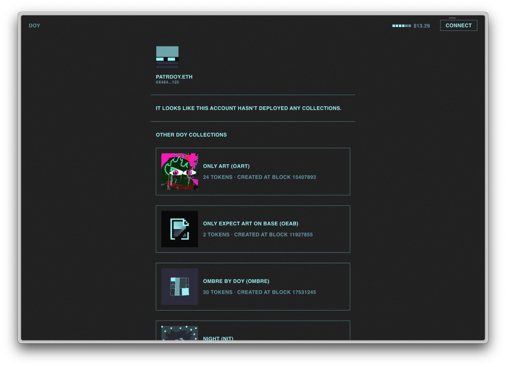
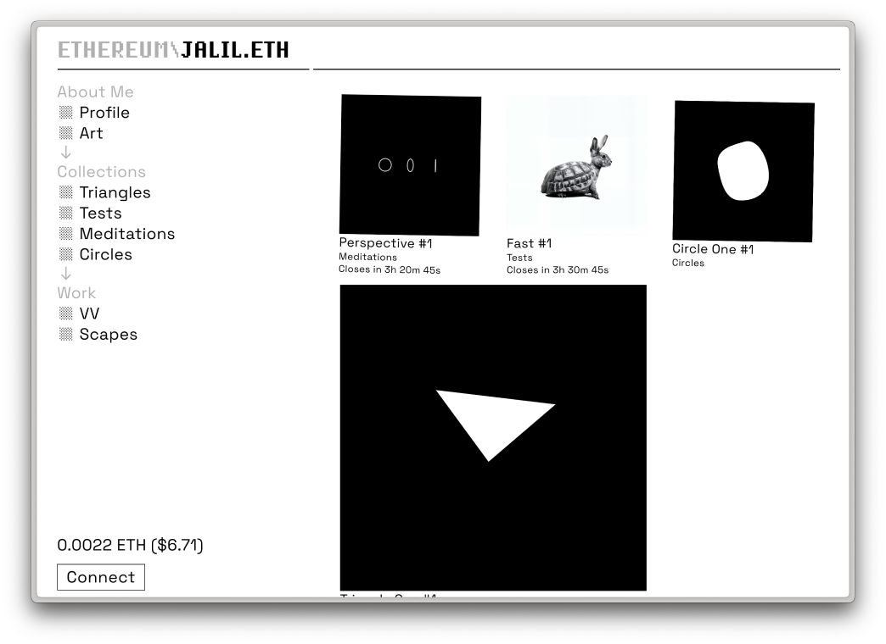
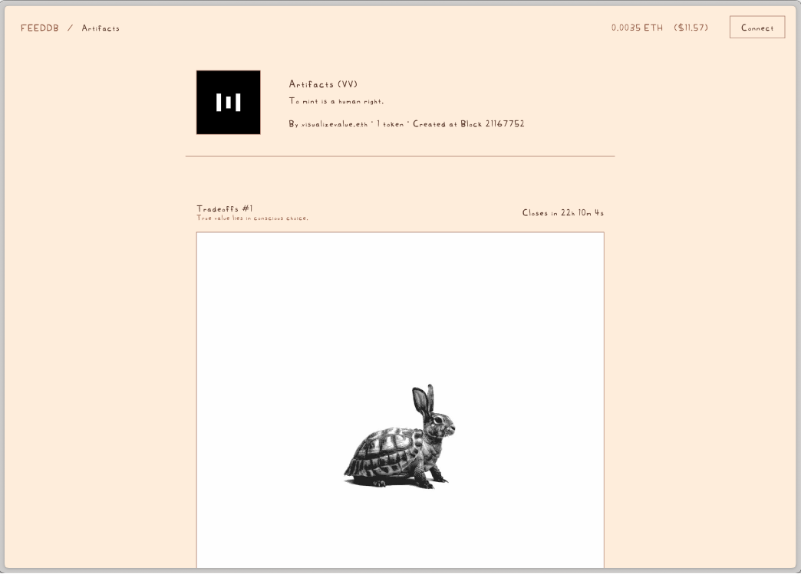

# Themes

## Base

The barebones application with minimal styling.
An example is running on [base.mint.jalil.cc](https://base.mint.jalil.cc).

## Zinc

The main example theme running on [mint.jalil.cc](https://mint.jalil.cc) and [networked.art](https://networked.art).

## Artist Theme

The Artist theme features a customizable color palette and includes support for showcasing older collections. It also integrates a custom MintGasPrice Indicator component. 

Live Example: [doy.worldcomputer.art](https://doy.worldcomputer.art).

## Ethereum Gallery

The Ethereum Gallery theme offers a completely redesigned layout.

Live Example: [jalil.worldcomputer.art](https://jalil.worldcomputer.art).

## FEEDDB

The FEEDDB theme introduces a unique aesthetic inspired by the color beige (#feeddb) and incorporates Aaron Aalto's handwritten font.

Live Example: [feeddb.worldcomputer.art](https://feeddb.worldcomputer.art).