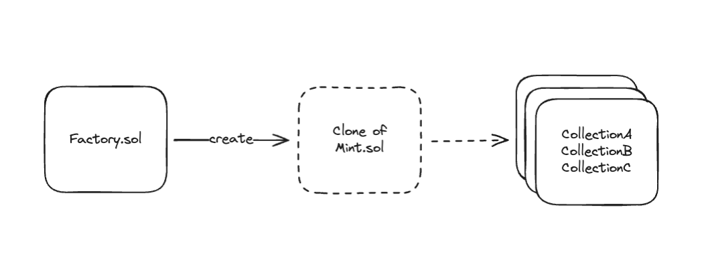
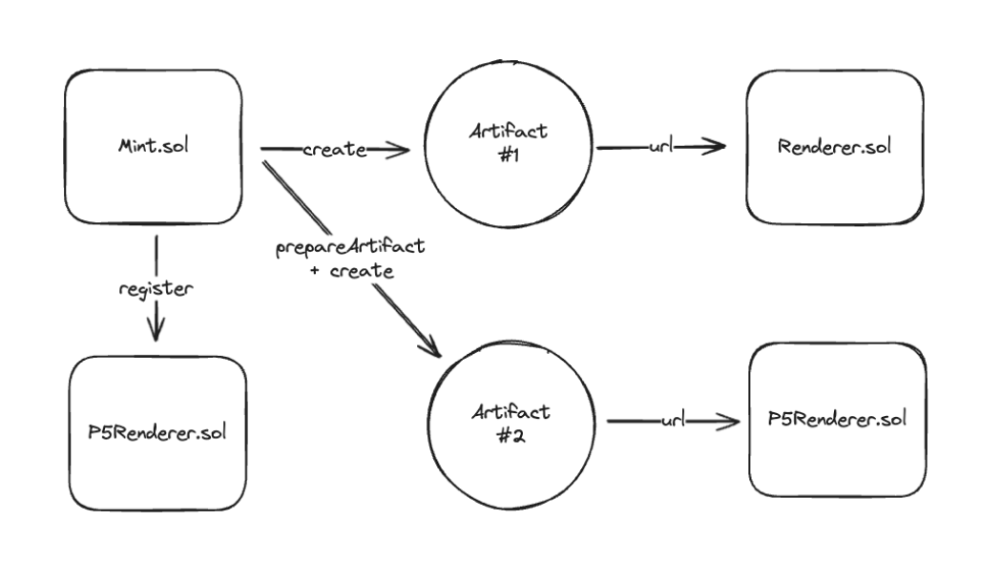

# Contracts Overview

The mint protocol comes with two main contracts that users interact with:
The [`Factory.sol`](https://github.com/visualizevalue/mint/blob/main/contracts/contracts/factories/FactoryV1.sol) creator contract
and the [`Mint.sol`](https://github.com/visualizevalue/mint/blob/main/contracts/contracts/Mint.sol) collections.

The Factory Contract facilitates the creation of new collection contracts.

The Mint Contract(s) are artist-owned collection contracts.

These collections are simple & immutable [ERC1155](https://eips.ethereum.org/EIPS/eip-1155)
contracts that allow the artist to mint and distribute their art.

Mint contracts provide a standardized way to distribute these artifacts in a
time-boxed, open, and protocol-native manner.

Further, they allow artists to register custom renderer contracts for each 
token they mint.

Renderers can implement arbitrary logic to customize the artifact metadata
and contents.

Each token can define its own renderer contract and/or pass encoded data to it
to e.g. customize the renderer functionality.

The default [`Renderer.sol`](https://github.com/visualizevalue/mint/blob/main/contracts/contracts/renderers/Renderer.sol) simply takes
the artifact data and encodes it as a blob. But developers have
complete freedom to build custom renderers as they like.
