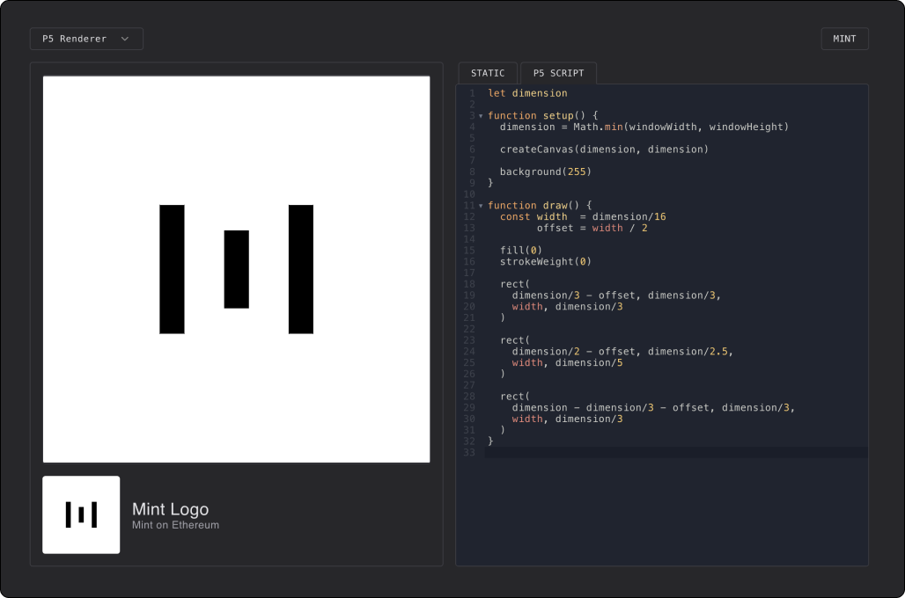

# Renderers

## About Renderers

Artifacts are stored as submitted by the user using SSTORE2.

When users call the `uri()` method, the token checks for its registered
renderer contract and hands off rendering of the metadata to
the specific token renderer.

```solidity{7}
/// @notice Get the metadata for a given token id.
function uri(uint tokenId) external override view returns (string memory) {
    if (tokenId > latestTokenId) revert NonExistentToken();

    Token memory token = tokens[tokenId];

    return IRenderer(renderers[token.renderer]).uri(tokenId, token, artifact(tokenId));
}

/// @notice Read an artifact.
function artifact (uint tokenId) public view returns (bytes memory content) {
    Token memory token = tokens[tokenId];

    for (uint8 i = 0; i < token.artifact.length; i++) {
        content = abi.encodePacked(content, SSTORE2.read(token.artifact[i]));
    }
}
```

All renderers have to implement the simple `IRenderer` interface.
They receive the `tokenId`, the `token` metadata (name, description, ...)
and the resolved `artifact` data.

::: code-group

```solidity [IRenderer.sol]
interface IRenderer {

    function uri (
        uint tokenId,
        Token calldata token,
        bytes memory artifact
    ) external view returns (string memory)

}
```

```solidity [Token.sol]
struct Token {
    string  name;         // token name
    string  description; // token description
    address[] artifact; // artifact pointers (image/artwork) data
    uint32  renderer;  // index of renderer contract address
    uint64  mintedAt; // timestamp of token creation
    uint160 data;    // optional data for renderers
}
```

:::

How renderers generate the metadata is entirely up to them.

## Default Renderer

The base renderer implementation that ships with every
Mint contract by default simply returns
artifact data as a blob.

```solidity
contract Renderer is IRenderer {

    function uri (uint tokenId, Token calldata token, bytes memory artifact) external pure returns (string memory) {
        bytes memory dataURI = abi.encodePacked(
            '{',
                '"id": "', Strings.toString(tokenId), '",',
                '"name": "', token.name, '",',
                '"description": "', token.description, '",',
                '"image": "', artifact, '"',
            '}'
        );

        return string(
            abi.encodePacked(
                "data:application/json;base64,",
                Base64.encode(dataURI)
            )
        );
    }

}
```

## Renderer Extensions

### P5 Renderer

As an initial extension example, we have built a renderer for generating [p5.js](https://p5js.org/)
based artifacts onchain.

Check out the [`P5Renderer.sol`](https://github.com/visualizevalue/mint/blob/main/contracts/contracts/renderers/P5Renderer.sol) on Github.

This renderer also comes with its custom UI implementation to edit and preview the P5 script.



How this works under the hood is that we encode both the static asset and the script content
within the artifact bytecode, and decode it into its parts during rendering.

Also note how the renderer exposes both a `script_url` with just the artists' p5 script
and the complete `animation_url` with the entire encoded html page.

```solidity {9}
/// @notice Generate the JSON medata for a given token.
///         We expect the static preview image and P5 script
//          to both be encoded in the artifact data.
function uri (
    uint tokenId,
    Token calldata token,
    bytes memory artifact
) external view returns (string memory) {
    (string memory image, string memory script) = abi.decode(artifact, (string, string));

    bytes memory dataURI = abi.encodePacked(
        '{',
            '"id": "', Strings.toString(tokenId), '",',
            '"name": "', token.name, '",',
            '"description": "', token.description, '",',
            '"image": "', image, '",',
            '"script_url": "data:text/javascript;base64,', Base64.encode(bytes(script)), '",',
            '"animation_url": "', generateHtml(token.name, script), '"',
        '}'
    );

    return string(
        abi.encodePacked(
            "data:application/json;base64,",
            Base64.encode(dataURI)
        )
    );
}
```

### Community Renderers

Developers are invited to get creative and contribute their own to the ecosystem.

